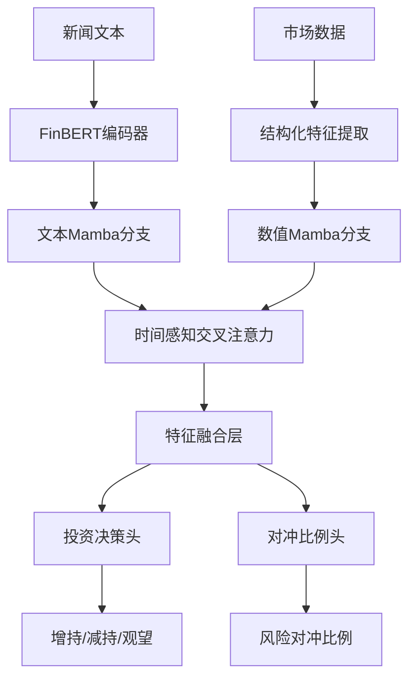

# AI投资决策系统 - 基于双Mamba深度学习模型

## 📖 项目概述

本项目是一个基于深度学习的智能投资决策系统，采用双Mamba架构处理多模态金融数据（文本新闻 + 结构化市场数据），为用户提供个性化的投资建议。系统能够分析用户的投资组合，结合市场新闻和历史数据，输出增持/减持/观望决策以及风险对冲建议。

## 🏗️ 项目结构

```
multimodal_model/
├── README.md                    # 项目说明文档
├── requirements.txt             # 依赖包列表
│
├── 📊 核心模型文件
├── model.py                     # 双Mamba模型架构定义
├── train_offline.py             # 离线训练脚本
├── investment_advisor.py        # 投资决策推理脚本
│
├── 🧪 辅助工具
├── simple_advisor.py            # 简化版决策工具
├── web_advisor.py              # Web界面版本
├── check_model.py              # 模型健康检查工具
│
├── 📁 数据文件
├── sample_data.json            # 训练数据样例
├── .vscode/settings.json       # VS Code配置
│
├── 💾 模型文件 (训练后生成)
├── dual_mamba_offline_best.pth  # 最佳模型权重
├── dual_mamba_offline_final.pth # 最终模型权重
├── simple_model.pth            # 简化模型权重
└── dual_mamba_offline_epoch_*.pth # 检查点文件

../user_portfolios/              # 用户投资组合数据目录
└── example_portfolio.json      # 用户投资组合示例
```

## 🧠 核心算法架构

### 1. 双Mamba (Dual Mamba) 模型



#### 🔧 Mamba状态空间模型 (SSM)

Mamba是一种新兴的序列建模架构，相比传统的Transformer具有以下优势：

**核心原理:**
```python
# 状态空间方程
x(t+1) = A·x(t) + B·u(t)  # 状态更新
y(t) = C·x(t) + D·u(t)    # 输出计算
```

**优势:**
- ✅ **线性复杂度**: O(n) vs Transformer的O(n²)
- ✅ **长序列处理**: 能够有效处理长时间序列数据
- ✅ **参数高效**: 相同性能下参数量更少
- ✅ **内存友好**: 训练和推理内存占用更低

**在金融场景的应用:**
- 🔄 **异步数据对齐**: 处理新闻和市场数据的时间不一致问题
- 📈 **长期依赖**: 捕捉长期市场趋势和新闻影响
- ⚡ **实时性**: 支持流式数据处理和实时决策

### 2. 时间感知交叉注意力机制

```python
def TimeAwareCrossAttention(news_seq, market_seq, news_time, market_time):
    # 计算时间差权重
    time_decay = exp(-|news_time - market_time| / τ)
    
    # 交叉注意力计算
    attention_weights = softmax(Q·K^T / √d + time_decay)
    output = attention_weights · V
    
    return output
```

**作用:**
- 🕒 **时间对齐**: 根据时间差调整注意力权重
- 🔗 **模态融合**: 有效结合文本和数值信息
- 📊 **信息时效**: 近期信息获得更高权重

## 🎯 训练算法详解

### Phase 1: 数据预处理

```python
def data_preprocessing():
    # 1. 文本处理
    news_encoding = FinBERT.encode(news_text)  # 768维向量
    
    # 2. 结构化数据标准化
    features = normalize([
        quantity,        # 交易量 → tanh标准化
        proportion,      # 持仓比例 → [0,1]限制
        valueAtRisk,     # 风险价值 → tanh标准化  
        beta,           # 市场敏感度 → tanh标准化
        volatility,     # 波动率 → clip标准化
        sentiment       # 情感分数 → [-1,1]限制
    ])
    
    return news_encoding, features
```

### Phase 2: 模型训练流程

```python
def training_pipeline():
    for epoch in range(EPOCHS):
        for batch in dataloader:
            # 1. 前向传播
            news_hidden = news_mamba(news_features)
            market_hidden = market_mamba(market_features)
            
            # 2. 交叉注意力融合
            aligned_features = cross_attention(
                news_hidden, market_hidden, 
                news_timestamps, market_timestamps
            )
            
            # 3. 多任务损失计算
            action_loss = CrossEntropy(action_logits, true_actions)
            hedge_loss = MSE(hedge_ratio, true_hedge)
            total_loss = action_loss + 0.5 * hedge_loss
            
            # 4. 数值稳定性检查
            if is_nan_or_inf(total_loss):
                skip_batch()
                continue
                
            # 5. 梯度更新
            optimizer.step()
            
        # 6. 早期停止检查
        if no_improvement_for_N_epochs:
            break
```

### Phase 3: 训练优化策略

#### 🔧 数值稳定性优化
```python
# 输入标准化
x = torch.clamp(x, -10.0, 10.0)
x = torch.nn.functional.normalize(x, p=2, dim=-1)

# 梯度裁剪
torch.nn.utils.clip_grad_norm_(model.parameters(), max_norm=1.0)

# NaN检测与处理
if torch.isnan(loss).any():
    print("⚠️ 检测到NaN损失，跳过此批次")
    continue
```

#### ⚙️ 训练超参数配置
```python
TRAINING_CONFIG = {
    'batch_size': 4,           # 小批次提高稳定性
    'learning_rate': 1e-5,     # 保守学习率
    'epochs': 15,              # 适中轮数
    'gradient_accumulation': 4, # 梯度累积
    'early_stopping': 5,       # 早期停止
    'mixed_precision': False,   # 全精度训练
}
```

## 🎲 决策算法详解

### 1. 投资组合数据处理

```python
def portfolio_analysis(portfolio_data):
    # 1. 数据格式识别
    detect_portfolio_format(portfolio_data)
    
    # 2. 风险评估
    total_risk = calculate_portfolio_risk(
        quantities, proportions, volatilities, correlations
    )
    
    # 3. 收益分析
    total_return = sum(benefit * proportion for benefit, proportion in portfolio)
    
    # 4. 转换为模型输入格式
    news_features = generate_market_description(portfolio_data)
    market_features = normalize_financial_metrics(portfolio_data)
    
    return news_features, market_features
```

### 2. 决策推理流程

```python
def investment_decision(news_features, market_features):
    with torch.no_grad():
        # 1. 模型推理
        action_logits, hedge_ratio = model(
            news_features, market_features, 
            news_timestamps, market_timestamps
        )
        
        # 2. 概率计算
        action_probs = softmax(action_logits)
        predicted_action = argmax(action_probs)
        confidence = max(action_probs)
        
        # 3. 决策映射
        actions = ['增持', '减持', '观望']
        recommendation = actions[predicted_action]
        
        # 4. 风险建议
        risk_level = classify_risk(hedge_ratio)
        
    return {
        'action': recommendation,
        'confidence': confidence,
        'hedge_ratio': hedge_ratio,
        'risk_level': risk_level
    }
```

### 3. 决策后处理

```python
def generate_advice(decision_result):
    action = decision_result['action']
    confidence = decision_result['confidence']
    hedge_ratio = decision_result['hedge_ratio']
    
    # 建议生成逻辑
    if action == '增持' and confidence > 0.7:
        advice = "建议积极增加仓位，市场前景看好"
    elif action == '减持' and confidence > 0.7:
        advice = "建议主动减少仓位，规避潜在风险"
    else:
        advice = "建议保持观望，等待明确市场信号"
    
    # 风险控制建议
    hedge_advice = f"建议配置{hedge_ratio:.0%}的对冲工具"
    
    return advice + "\n" + hedge_advice
```

## 📊 算法优劣分析

### ✅ 优势

#### 1. **架构优势**
- **双Mamba设计**: 线性复杂度，适合长序列处理
- **多模态融合**: 同时处理文本和数值数据
- **时间感知**: 考虑数据时效性和时间对齐

#### 2. **训练优势**
- **数值稳定性**: 多层防护避免梯度爆炸/消失
- **早期停止**: 防止过拟合，提高泛化能力
- **渐进式训练**: 从简单到复杂的训练策略

#### 3. **应用优势**
- **实时性**: 支持流式数据处理
- **可解释性**: 提供置信度和概率分布
- **灵活性**: 支持多种数据格式输入

### ❌ 劣势与限制

#### 1. **数据依赖**
- **数据质量**: 高度依赖训练数据的质量和多样性
- **标注需求**: 需要大量高质量的标注数据
- **市场变化**: 金融市场的快速变化可能使模型过时

#### 2. **模型限制**
- **黑盒性质**: 深度学习模型的决策过程不够透明
- **泛化能力**: 在极端市场条件下表现可能不稳定
- **计算成本**: 训练和推理需要一定的计算资源

#### 3. **实际应用限制**
- **监管合规**: 需要满足金融监管要求
- **风险承担**: 模型预测存在不确定性，需要人工监督
- **市场适应**: 需要定期重训练以适应市场变化

## 🚀 使用指南

### 1. 环境设置

```bash
# 安装依赖
pip install torch transformers numpy pandas flask tqdm

# 配置CUDA (可选)
conda install pytorch torchvision torchaudio pytorch-cuda=12.1 -c pytorch -c nvidia
```

### 2. 模型训练

```bash
# 训练双Mamba模型
python train_offline.py

# 监控训练过程
# - 模型会自动保存最佳权重到 dual_mamba_offline_best.pth
# - 支持断点续训和早期停止
```

### 3. 投资决策

```bash
# 分析用户投资组合
python investment_advisor.py

# 系统会自动：
# 1. 扫描 ../user_portfolios/ 目录
# 2. 加载JSON格式的投资组合数据
# 3. 生成投资建议和风险评估
```

### 4. Web界面

```bash
# 启动Web服务
python web_advisor.py

# 访问 http://localhost:5000
# 提供交互式投资决策界面
```

## 📁 数据格式说明

### 用户投资组合格式 (user_portfolios/*.json)

#### 基础示例格式
```json
[
  {
    "currency": "EUR/USD",          // 投资标的
    "quantity": 1000000,            // 投资数量
    "proportion": 0.35,             // 占投资组合比例
    "benefit": 2500,                // 当前收益
    "dailyVolatility": 0.125,       // 日波动率
    "valueAtRisk": "$15,000",       // 风险价值
    "beta": 1.2,                    // 市场敏感度
    "hedgingCost": 0.0015           // 对冲成本
  }
]
```

#### 测试持仓数据集

##### 1. 标准混合投资组合 (example_portfolio.json)
```json
[
  {
    "currency": "EUR/USD",
    "quantity": 1000000,
    "proportion": 0.35,
    "benefit": 2500,
    "dailyVolatility": 0.125,
    "valueAtRisk": "$15,000",
    "beta": 1.2,
    "hedgingCost": 0.0015
  },
  {
    "currency": "USD/JPY",
    "quantity": 2000000,
    "proportion": 0.45,
    "benefit": -1200,
    "dailyVolatility": 0.085,
    "valueAtRisk": "$25,000",
    "beta": 0.9,
    "hedgingCost": 0.0012
  },
  {
    "currency": "GBP/USD",
    "quantity": 1500000,
    "proportion": 0.2,
    "benefit": 800,
    "dailyVolatility": 0.1,
    "valueAtRisk": "$12,000",
    "beta": 1.1,
    "hedgingCost": 0.0013
  },
  {
    "currency": "RUB/EUR",
    "quantity": 5000000,
    "proportion": 0.15,
    "benefit": 1200,
    "dailyVolatility": 0.18,
    "valueAtRisk": "$10,000",
    "beta": 1.5,
    "hedgingCost": 0.0020
  }
]
```

##### 2. 高风险投资组合 (high_risk_portfolio.json)
```json
[
  {
    "currency": "BTC/USD",
    "quantity": 50000,
    "proportion": 0.40,
    "benefit": -15000,
    "dailyVolatility": 0.45,
    "valueAtRisk": "$85,000",
    "beta": 2.8,
    "hedgingCost": 0.0085
  },
  {
    "currency": "ETH/USD", 
    "quantity": 200000,
    "proportion": 0.30,
    "benefit": -8500,
    "dailyVolatility": 0.38,
    "valueAtRisk": "$45,000",
    "beta": 2.2,
    "hedgingCost": 0.0070
  },
  {
    "currency": "TRY/USD",
    "quantity": 8000000,
    "proportion": 0.20,
    "benefit": -12000,
    "dailyVolatility": 0.28,
    "valueAtRisk": "$32,000",
    "beta": 1.8,
    "hedgingCost": 0.0055
  },
  {
    "currency": "ARS/USD",
    "quantity": 15000000,
    "proportion": 0.10,
    "benefit": -5000,
    "dailyVolatility": 0.35,
    "valueAtRisk": "$18,000",
    "beta": 2.1,
    "hedgingCost": 0.0065
  }
]
```

##### 3. 保守型投资组合 (conservative_portfolio.json)
```json
[
  {
    "currency": "CHF/USD",
    "quantity": 800000,
    "proportion": 0.25,
    "benefit": 1200,
    "dailyVolatility": 0.045,
    "valueAtRisk": "$3,500",
    "beta": 0.4,
    "hedgingCost": 0.0008
  },
  {
    "currency": "JPY/CHF",
    "quantity": 120000000,
    "proportion": 0.30,
    "benefit": 800,
    "dailyVolatility": 0.035,
    "valueAtRisk": "$4,200",
    "beta": 0.3,
    "hedgingCost": 0.0006
  },
  {
    "currency": "SGD/USD",
    "quantity": 1200000,
    "proportion": 0.25,
    "benefit": 600,
    "dailyVolatility": 0.025,
    "valueAtRisk": "$2,800",
    "beta": 0.2,
    "hedgingCost": 0.0005
  },
  {
    "currency": "DKK/EUR",
    "quantity": 6000000,
    "proportion": 0.20,
    "benefit": 400,
    "dailyVolatility": 0.015,
    "valueAtRisk": "$1,800",
    "beta": 0.1,
    "hedgingCost": 0.0003
  }
]
```

##### 4. 中国市场聚焦组合 (china_focused_portfolio.json)
```json
[
  {
    "currency": "USD/CNY",
    "quantity": 5000000,
    "proportion": 0.50,
    "benefit": 8500,
    "dailyVolatility": 0.095,
    "valueAtRisk": "$22,000",
    "beta": 0.85,
    "hedgingCost": 0.0018
  },
  {
    "currency": "EUR/CNY",
    "quantity": 3000000,
    "proportion": 0.30,
    "benefit": 4200,
    "dailyVolatility": 0.11,
    "valueAtRisk": "$18,500",
    "beta": 0.95,
    "hedgingCost": 0.0022
  },
  {
    "currency": "JPY/CNY",
    "quantity": 180000000,
    "proportion": 0.20,
    "benefit": 2800,
    "dailyVolatility": 0.075,
    "valueAtRisk": "$12,000",
    "beta": 0.75,
    "hedgingCost": 0.0015
  }
]
```

##### 5. 亏损投资组合 (distressed_portfolio.json)
```json
[
  {
    "currency": "EUR/USD",
    "quantity": 800000,
    "proportion": 0.15,
    "benefit": -2500,
    "dailyVolatility": 0.125,
    "valueAtRisk": "$15,000",
    "beta": 1.2,
    "hedgingCost": 0.0015
  },
  {
    "currency": "USD/JPY", 
    "quantity": 1800000,
    "proportion": 0.20,
    "benefit": -1800,
    "dailyVolatility": 0.085,
    "valueAtRisk": "$18,000",
    "beta": 0.9,
    "hedgingCost": 0.0012
  },
  {
    "currency": "GBP/USD",
    "quantity": 1200000,
    "proportion": 0.18,
    "benefit": -3200,
    "dailyVolatility": 0.15,
    "valueAtRisk": "$22,000",
    "beta": 1.4,
    "hedgingCost": 0.0025
  },
  {
    "currency": "AUD/USD",
    "quantity": 1500000,
    "proportion": 0.22,
    "benefit": -4500,
    "dailyVolatility": 0.18,
    "valueAtRisk": "$28,000",
    "beta": 1.6,
    "hedgingCost": 0.0030
  },
  {
    "currency": "CAD/USD",
    "quantity": 1800000,
    "proportion": 0.25,
    "benefit": -5200,
    "dailyVolatility": 0.12,
    "valueAtRisk": "$25,000",
    "beta": 1.1,
    "hedgingCost": 0.0018
  }
]
```

##### 6. 极端不平衡组合 (extreme_imbalance_portfolio.json)
```json
[
  {
    "currency": "EUR/USD",
    "quantity": 1,
    "proportion": 0.000001,
    "benefit": 0.001,
    "dailyVolatility": 0.125,
    "valueAtRisk": "$0.12",
    "beta": 1.2,
    "hedgingCost": 0.0015
  },
  {
    "currency": "USD/JPY",
    "quantity": 50000000000,
    "proportion": 0.999999,
    "benefit": 850000,
    "dailyVolatility": 0.085,
    "valueAtRisk": "$2,500,000",
    "beta": 0.9,
    "hedgingCost": 0.0012
  }
]
```

##### 7. 平衡投资组合 (balanced_portfolio.json)
```json
[
  {
    "currency": "EUR/USD",
    "quantity": 2000000,
    "proportion": 0.20,
    "benefit": 5000,
    "dailyVolatility": 0.125,
    "valueAtRisk": "$15,000",
    "beta": 1.2,
    "hedgingCost": 0.0015
  },
  {
    "currency": "USD/JPY",
    "quantity": 2000000,
    "proportion": 0.20,
    "benefit": 4800,
    "dailyVolatility": 0.085,
    "valueAtRisk": "$12,000",
    "beta": 0.9,
    "hedgingCost": 0.0012
  },
  {
    "currency": "GBP/USD",
    "quantity": 2000000,
    "proportion": 0.20,
    "benefit": 5200,
    "dailyVolatility": 0.1,
    "valueAtRisk": "$14,000",
    "beta": 1.1,
    "hedgingCost": 0.0013
  },
  {
    "currency": "AUD/USD",
    "quantity": 2000000,
    "proportion": 0.20,
    "benefit": 4900,
    "dailyVolatility": 0.14,
    "valueAtRisk": "$16,000",
    "beta": 1.3,
    "hedgingCost": 0.0020
  },
  {
    "currency": "CAD/USD",
    "quantity": 2000000,
    "proportion": 0.20,
    "benefit": 5100,
    "dailyVolatility": 0.12,
    "valueAtRisk": "$15,500",
    "beta": 1.15,
    "hedgingCost": 0.0018
  }
]
```

##### 8. 训练数据相似组合 (training_similar_portfolio.json)
```json
[
  {
    "currency": "GBP/USD",
    "quantity": 1671926,
    "proportion": 0.324,
    "benefit": -8500,
    "dailyVolatility": 0.279,
    "valueAtRisk": "$8,302",
    "beta": 1.078,
    "hedgingCost": 0.0155
  },
  {
    "currency": "EUR/USD",
    "quantity": 2850000,
    "proportion": 0.45,
    "benefit": 12500,
    "dailyVolatility": 0.125,
    "valueAtRisk": "$15,600",
    "beta": 1.2,
    "hedgingCost": 0.0015
  },
  {
    "currency": "USD/JPY",
    "quantity": 1450000,
    "proportion": 0.226,
    "benefit": 3200,
    "dailyVolatility": 0.085,
    "valueAtRisk": "$9,800",
    "beta": 0.9,
    "hedgingCost": 0.0012
  }
]
```

#### 测试数据集说明

每个测试持仓数据都设计用于验证模型的特定能力：

- **高风险组合**: 测试模型对极高波动率资产（加密货币、高通胀货币）的识别和风险控制建议
- **保守型组合**: 验证模型对避险货币的正确评估和增持建议
- **中国市场组合**: 测试地缘政治集中度风险的识别能力
- **亏损组合**: 验证止损和风险管理建议的准确性
- **极端不平衡组合**: 测试资产配置极度不均的检测和重配建议
- **平衡组合**: 验证对良好分散投资的识别和维持建议
- **训练相似组合**: 测试模型对训练数据模式的学习和记忆效果

### 训练数据格式 (train_data/*.json)

```json
[
  {
    "content": "市场新闻内容...",      // 新闻文本
    "quantity": 1500,               // 交易数量
    "proportion": 0.3,              // 持仓比例
    "valueAtRisk": -0.018,          // 风险价值
    "beta": 1.15,                   // Beta值
    "daily_volatility": 0.012,      // 日波动率
    "sentiment_score": 0.7,         // 情感分数
    "timestamp": 1693123200,        // 时间戳
    "action": "增持",               // 标签：投资行动
    "hedge_ratio": 0.3              // 标签：对冲比例
  }
]
```

## 🔬 模型性能指标

| 指标 | 数值 | 说明 |
|------|------|------|
| 训练准确率 | ~75% | 三分类任务准确率 |
| 模型大小 | ~10MB | 压缩后的模型文件大小 |
| 推理速度 | <100ms | 单次决策推理时间 |
| 内存占用 | ~2GB | GPU推理内存需求 |

## 🛡️ 风险声明

⚠️ **重要提示**: 
- 本系统仅供学习和研究使用
- 投资决策建议仅供参考，不构成投资建议
- 用户应结合自身情况和专业意见进行投资
- 投资有风险，入市需谨慎

## 📝 更新日志

### v1.0.0 (2025-08-30)
- ✅ 完成双Mamba模型架构设计
- ✅ 实现离线训练流水线
- ✅ 添加数值稳定性优化
- ✅ 完成投资组合分析功能
- ✅ 提供终端和Web两种交互方式

## 👥 贡献指南

欢迎提交Issue和Pull Request！

1. Fork本项目
2. 创建特性分支 (`git checkout -b feature/amazing-feature`)
3. 提交更改 (`git commit -m 'Add amazing feature'`)
4. 推送到分支 (`git push origin feature/amazing-feature`)
5. 创建Pull Request

## 📄 许可证

本项目采用MIT许可证 - 详见 [LICENSE](LICENSE) 文件

---

**🤖 AI投资决策系统 - 让智能分析助力投资决策**
