# AI投资决策系统 - 基于双Mamba深度学习模型

## 📖 项目概述

本项目是一个基于深度学习的智能投资决策系统，采用双Mamba架构处理多模态金融数据（文本新闻 + 结构化市场数据），为用户提供个性化的投资建议。系统能够分析用户的投资组合，结合市场新闻和历史数据，输出增持/减持/观望决策以及风险对冲建议。

**当前版本提供终端界面的投资决策系统，支持离线训练和推理，适用于学习研究和小规模投资分析。**

## 🏗️ 项目结构

```
multimodal_model/
├── README.md                    # 项目说明文档
├── MODEL_DOWNLOAD.md            # 模型下载指南
├── setup_finbert.py             # FinBERT模型下载脚本
├── setup_finbert_from_existing.py # FinBERT智能配置脚本 (推荐)
├── requirements.txt             # 完整依赖包列表
├── requirements_simple.txt      # 精简依赖包列表
│
├── 📊 核心模型文件
├── model.py                     # 双Mamba模型架构定义
├── train_offline.py             # 离线训练脚本
├── investment_advisor.py        # 投资决策推理脚本（终端界面）
│
├── 🤖 模型文件目录
├── models/
│   ├── README.md               # 模型配置说明
│   └── finbert-tone/           # FinBERT模型文件 (需要下载)
│       ├── config.json         # 模型配置
│       ├── pytorch_model.bin   # 模型权重 (~418MB) [旧格式]
│       ├── model.safetensors   # 模型权重 (~418MB) [新格式]
│       ├── tokenizer_config.json # 分词器配置
│       └── vocab.txt           # 词汇表
│
├── 📁 数据文件
├── sample_data.json            # 训练数据样例
├── config.ini                  # 配置文件
├── .vscode/settings.json       # VS Code配置
│
├── 💾 模型文件 (训练后生成)
├── dual_mamba_offline_best.pth  # 最佳模型权重 (推荐使用)
├── dual_mamba_offline_final.pth # 最终模型权重
└── dual_mamba_offline_epoch_*.pth # 训练检查点文件

├── 📊 训练数据
├── train_data/
│   ├── sequence_train_data.json # 完整训练数据集 (2.4MB)
│   └── README.md               # 训练数据说明
│
└── 🧪 测试数据
└── user_portfolios/            # 用户投资组合测试数据
    ├── example_portfolio.json  # 标准混合投资组合
    ├── high_risk_portfolio.json # 高风险投资组合
    ├── conservative_portfolio.json # 保守型投资组合
    ├── china_focused_portfolio.json # 中国市场聚焦组合
    ├── balanced_portfolio.json # 平衡型投资组合
    ├── distressed_portfolio.json # 困境投资组合
    ├── extreme_imbalance_portfolio.json # 极度不平衡组合
    └── training_similar_portfolio.json # 训练样本相似组合
```
    ├── distressed_portfolio.json # 亏损投资组合
    ├── extreme_imbalance_portfolio.json # 极端不平衡组合
    ├── balanced_portfolio.json # 平衡投资组合
    └── training_similar_portfolio.json # 训练数据相似组合
```

## 🧠 核心算法架构

### 1. 双Mamba (Dual Mamba) 模型

```mermaid
graph TD
    A[新闻文本] --> B[FinBERT编码器]
    C[市场数据] --> D[结构化特征提取]
    
    B --> E[文本Mamba分支]
    D --> F[数值Mamba分支]
    
    E --> G[时间感知交叉注意力]
    F --> G
    
    G --> H[特征融合层]
    H --> I[投资决策头]
    H --> J[对冲比例头]
    
    I --> K[增持/减持/观望]
    J --> L[风险对冲比例]
```



#### 🔧 Mamba状态空间模型 (SSM)

Mamba是一种新兴的序列建模架构，相比传统的Transformer具有以下优势：

**核心原理:**
```python
# 状态空间方程
x(t+1) = A·x(t) + B·u(t)  # 状态更新
y(t) = C·x(t) + D·u(t)    # 输出计算
```

**优势:**
- ✅ **线性复杂度**: O(n) vs Transformer的O(n²)
- ✅ **长序列处理**: 能够有效处理长时间序列数据
- ✅ **参数高效**: 相同性能下参数量更少
- ✅ **内存友好**: 训练和推理内存占用更低

**在金融场景的应用:**
- 🔄 **异步数据对齐**: 处理新闻和市场数据的时间不一致问题
- 📈 **长期依赖**: 捕捉长期市场趋势和新闻影响
- ⚡ **实时性**: 支持流式数据处理和实时决策

### 2. 时间感知交叉注意力机制

```python
def TimeAwareCrossAttention(news_seq, market_seq, news_time, market_time):
    # 计算时间差权重
    time_decay = exp(-|news_time - market_time| / τ)
    
    # 交叉注意力计算
    attention_weights = softmax(Q·K^T / √d + time_decay)
    output = attention_weights · V
    
    return output
```

**作用:**
- 🕒 **时间对齐**: 根据时间差调整注意力权重
- 🔗 **模态融合**: 有效结合文本和数值信息
- 📊 **信息时效**: 近期信息获得更高权重

## 🎯 训练算法详解

### Phase 1: 数据预处理

```python
def data_preprocessing():
    # 1. 文本处理
    news_encoding = FinBERT.encode(news_text)  # 768维向量
    
    # 2. 结构化数据标准化
    features = normalize([
        quantity,        # 交易量 → tanh标准化
        proportion,      # 持仓比例 → [0,1]限制
        valueAtRisk,     # 风险价值 → tanh标准化  
        beta,           # 市场敏感度 → tanh标准化
        volatility,     # 波动率 → clip标准化
        sentiment       # 情感分数 → [-1,1]限制
    ])
    
    return news_encoding, features
```

### Phase 2: 模型训练流程

```python
def training_pipeline():
    for epoch in range(EPOCHS):
        for batch in dataloader:
            # 1. 前向传播
            news_hidden = news_mamba(news_features)
            market_hidden = market_mamba(market_features)
            
            # 2. 交叉注意力融合
            aligned_features = cross_attention(
                news_hidden, market_hidden, 
                news_timestamps, market_timestamps
            )
            
            # 3. 多任务损失计算
            action_loss = CrossEntropy(action_logits, true_actions)
            hedge_loss = MSE(hedge_ratio, true_hedge)
            total_loss = action_loss + 0.5 * hedge_loss
            
            # 4. 数值稳定性检查
            if is_nan_or_inf(total_loss):
                skip_batch()
                continue
                
            # 5. 梯度更新
            optimizer.step()
            
        # 6. 早期停止检查
        if no_improvement_for_N_epochs:
            break
```

### Phase 3: 训练优化策略

#### 🔧 数值稳定性优化
```python
# 输入标准化
x = torch.clamp(x, -10.0, 10.0)
x = torch.nn.functional.normalize(x, p=2, dim=-1)

# 梯度裁剪
torch.nn.utils.clip_grad_norm_(model.parameters(), max_norm=1.0)

# NaN检测与处理
if torch.isnan(loss).any():
    print("⚠️ 检测到NaN损失，跳过此批次")
    continue
```

#### ⚙️ 训练超参数配置
```python
TRAINING_CONFIG = {
    'batch_size': 4,           # 小批次提高稳定性
    'learning_rate': 1e-5,     # 保守学习率
    'epochs': 15,              # 适中轮数
    'gradient_accumulation': 4, # 梯度累积
    'early_stopping': 5,       # 早期停止
    'mixed_precision': False,   # 全精度训练
}
```

## 🎲 决策算法详解

### 1. 投资组合数据处理

```python
def portfolio_analysis(portfolio_data):
    # 1. 数据格式识别
    detect_portfolio_format(portfolio_data)
    
    # 2. 风险评估
    total_risk = calculate_portfolio_risk(
        quantities, proportions, volatilities, correlations
    )
    
    # 3. 收益分析
    total_return = sum(benefit * proportion for benefit, proportion in portfolio)
    
    # 4. 转换为模型输入格式
    news_features = generate_market_description(portfolio_data)
    market_features = normalize_financial_metrics(portfolio_data)
    
    return news_features, market_features
```

### 2. 决策推理流程

```python
def investment_decision(news_features, market_features):
    with torch.no_grad():
        # 1. 模型推理
        action_logits, hedge_ratio = model(
            news_features, market_features, 
            news_timestamps, market_timestamps
        )
        
        # 2. 概率计算
        action_probs = softmax(action_logits)
        predicted_action = argmax(action_probs)
        confidence = max(action_probs)
        
        # 3. 决策映射
        actions = ['增持', '减持', '观望']
        recommendation = actions[predicted_action]
        
        # 4. 风险建议
        risk_level = classify_risk(hedge_ratio)
        
    return {
        'action': recommendation,
        'confidence': confidence,
        'hedge_ratio': hedge_ratio,
        'risk_level': risk_level
    }
```

### 3. 决策后处理

```python
def generate_advice(decision_result):
    action = decision_result['action']
    confidence = decision_result['confidence']
    hedge_ratio = decision_result['hedge_ratio']
    
    # 建议生成逻辑
    if action == '增持' and confidence > 0.7:
        advice = "建议积极增加仓位，市场前景看好"
    elif action == '减持' and confidence > 0.7:
        advice = "建议主动减少仓位，规避潜在风险"
    else:
        advice = "建议保持观望，等待明确市场信号"
    
    # 风险控制建议
    hedge_advice = f"建议配置{hedge_ratio:.0%}的对冲工具"
    
    return advice + "\n" + hedge_advice
```

## 📊 算法优劣分析

### ✅ 优势

#### 1. **架构优势**
- **双Mamba设计**: 线性复杂度，适合长序列处理
- **多模态融合**: 同时处理文本和数值数据
- **时间感知**: 考虑数据时效性和时间对齐

#### 2. **训练优势**
- **数值稳定性**: 多层防护避免梯度爆炸/消失
- **早期停止**: 防止过拟合，提高泛化能力
- **渐进式训练**: 从简单到复杂的训练策略

#### 3. **应用优势**
- **实时性**: 支持流式数据处理
- **可解释性**: 提供置信度和概率分布
- **灵活性**: 支持多种数据格式输入

### ❌ 劣势与限制

#### 1. **数据依赖**
- **数据质量**: 高度依赖训练数据的质量和多样性
- **标注需求**: 需要大量高质量的标注数据
- **市场变化**: 金融市场的快速变化可能使模型过时

#### 2. **模型限制**
- **黑盒性质**: 深度学习模型的决策过程不够透明
- **泛化能力**: 在极端市场条件下表现可能不稳定
- **计算成本**: 训练和推理需要一定的计算资源

#### 3. **实际应用限制**
- **监管合规**: 需要满足金融监管要求
- **风险承担**: 模型预测存在不确定性，需要人工监督
- **市场适应**: 需要定期重训练以适应市场变化

## 🚀 使用指南

### 0. FinBERT模型配置 (必需)

**⚠️ 重要**: 在使用系统前，必须先配置FinBERT模型，否则系统无法运行。

#### � 一键配置 (最简单)

```bash
# 运行自动配置脚本
python setup_finbert.py

# 脚本会自动：
# 1. 检查Python环境和依赖
# 2. 创建models/finbert-tone目录
# 3. 从HuggingFace下载FinBERT模型
# 4. 验证模型文件完整性
# 5. 测试模型加载功能
```

```bash
# 使用HuggingFace下载
python -c "
from transformers import AutoTokenizer, AutoModel
import os

# 下载模型到项目目录
model_name = 'yiyanghkust/finbert-tone'
local_path = 'models/finbert-tone'

# 创建目录
os.makedirs(local_path, exist_ok=True)

# 下载模型和分词器
print('📥 正在下载FinBERT模型...')
tokenizer = AutoTokenizer.from_pretrained(model_name)
model = AutoModel.from_pretrained(model_name)

# 保存到本地
tokenizer.save_pretrained(local_path)
model.save_pretrained(local_path)

print(f'✅ FinBERT模型已下载到: {local_path}')
"
```

#### 📥 方法2: 手动下载

1. **访问HuggingFace模型页面**:
   ```
   https://huggingface.co/yiyanghkust/finbert-tone
   ```

2. **下载必需文件**到 `models/finbert-tone/` 目录:
   ```
   models/finbert-tone/
   ├── config.json                # 模型配置文件
   ├── pytorch_model.bin           # 模型权重文件 (~418MB) [旧格式]
   ├── model.safetensors          # 模型权重文件 (~418MB) [新格式]
   ├── tokenizer_config.json      # 分词器配置
   └── vocab.txt                  # 词汇表文件 (~220KB)
   ```
   
   **注意**: 支持两种模型格式:
   - **旧格式**: pytorch_model.bin
   - **新格式**: model.safetensors
   - 只需要其中一种即可

3. **使用Git LFS** (如果从本仓库克隆):
   ```bash
   git clone https://github.com/ksyou233/dual-mamba-investment-advisor.git
   cd dual-mamba-investment-advisor
   git lfs pull --include="models/**/*"
   ```

#### 🔧 验证安装

```bash
# 快速验证模型配置
python -c "
import os
from pathlib import Path

model_path = Path('models/finbert-tone')
print('🔍 检查FinBERT模型文件...')

if not model_path.exists():
    print('❌ models/finbert-tone 目录不存在')
    exit(1)

# 检查基础文件
basic_files = ['config.json', 'vocab.txt', 'tokenizer_config.json']
missing_basic = [f for f in basic_files if not (model_path / f).exists()]

# 检查模型文件 (支持两种格式)
has_pytorch = (model_path / 'pytorch_model.bin').exists()
has_safetensors = (model_path / 'model.safetensors').exists()

if missing_basic:
    print(f'❌ 缺少基础文件: {missing_basic}')
elif not (has_pytorch or has_safetensors):
    print('❌ 缺少模型权重文件 (pytorch_model.bin 或 model.safetensors)')
else:
    try:
        from transformers import AutoTokenizer, AutoModel
        tokenizer = AutoTokenizer.from_pretrained(str(model_path), local_files_only=True)
        model = AutoModel.from_pretrained(str(model_path), local_files_only=True)
        print('✅ FinBERT模型配置成功!')
        print(f'📊 模型输出维度: {model.config.hidden_size}')
        model_format = 'pytorch_model.bin' if has_pytorch else 'model.safetensors'
        print(f'📁 使用模型格式: {model_format}')
    except Exception as e:
        print(f'❌ 模型加载失败: {e}')
"
```

#### 📁 文件路径说明

**项目使用相对路径结构**:
```python
# 所有脚本会自动查找以下路径
models/finbert-tone/          # FinBERT模型目录
train_data/                   # 训练数据目录  
user_portfolios/              # 用户测试数据目录
```

**路径配置代码** (无需修改):
```python
# train_offline.py 和 investment_advisor.py 中的路径配置
import os
current_dir = os.path.dirname(os.path.abspath(__file__))
model_path = os.path.join(current_dir, 'models', 'finbert-tone')
```

#### ⚠️ 常见问题解决

| 问题 | 解决方案 |
|------|----------|
| `ModuleNotFoundError: transformers` | `pip install transformers>=4.20.0` |
| `OSError: Model not found` | 检查models/finbert-tone/目录是否存在且包含所有文件 |
| `CUDA out of memory` | 使用CPU模式或减小batch_size |
| 下载速度慢 | 使用国内镜像或科学上网 |

### 1. 环境设置

```bash
# 安装依赖
pip install torch transformers numpy pandas tqdm

# 配置CUDA (可选，推荐用于GPU训练)
conda install pytorch torchvision torchaudio pytorch-cuda=12.1 -c pytorch -c nvidia
```

### 2. 模型训练

```bash
# 训练双Mamba模型
python train_offline.py

# 监控训练过程
# - 模型会自动保存最佳权重到 dual_mamba_offline_best.pth
# - 支持断点续训和早期停止
```

### 3. 投资决策分析

```bash
# 分析用户投资组合（终端界面）
python investment_advisor.py

# 系统会自动：
# 1. 扫描 user_portfolios/ 目录
# 2. 加载JSON格式的投资组合数据
# 3. 生成投资建议和风险评估
# 4. 在终端显示详细分析报告
```

## 📁 数据格式说明

### 用户投资组合格式 (user_portfolios/*.json)

#### 基础示例格式
```json
[
  {
    "currency": "EUR/USD",          // 投资标的
    "quantity": 1000000,            // 投资数量
    "proportion": 0.35,             // 占投资组合比例
    "benefit": 2500,                // 当前收益
    "dailyVolatility": 0.125,       // 日波动率
    "valueAtRisk": "$15,000",       // 风险价值
    "beta": 1.2,                    // 市场敏感度
    "hedgingCost": 0.0015           // 对冲成本
  }
]
```

#### 测试持仓数据集

##### 1. 标准混合投资组合 (example_portfolio.json)
```json
[
  {
    "currency": "EUR/USD",
    "quantity": 1000000,
    "proportion": 0.35,
    "benefit": 2500,
    "dailyVolatility": 0.125,
    "valueAtRisk": "$15,000",
    "beta": 1.2,
    "hedgingCost": 0.0015
  },
  {
    "currency": "USD/JPY",
    "quantity": 2000000,
    "proportion": 0.45,
    "benefit": -1200,
    "dailyVolatility": 0.085,
    "valueAtRisk": "$25,000",
    "beta": 0.9,
    "hedgingCost": 0.0012
  },
  {
    "currency": "GBP/USD",
    "quantity": 1500000,
    "proportion": 0.2,
    "benefit": 800,
    "dailyVolatility": 0.1,
    "valueAtRisk": "$12,000",
    "beta": 1.1,
    "hedgingCost": 0.0013
  },
  {
    "currency": "RUB/EUR",
    "quantity": 5000000,
    "proportion": 0.15,
    "benefit": 1200,
    "dailyVolatility": 0.18,
    "valueAtRisk": "$10,000",
    "beta": 1.5,
    "hedgingCost": 0.0020
  }
]
```

##### 2. 高风险投资组合 (high_risk_portfolio.json)
```json
[
  {
    "currency": "BTC/USD",
    "quantity": 50000,
    "proportion": 0.40,
    "benefit": -15000,
    "dailyVolatility": 0.45,
    "valueAtRisk": "$85,000",
    "beta": 2.8,
    "hedgingCost": 0.0085
  },
  {
    "currency": "ETH/USD", 
    "quantity": 200000,
    "proportion": 0.30,
    "benefit": -8500,
    "dailyVolatility": 0.38,
    "valueAtRisk": "$45,000",
    "beta": 2.2,
    "hedgingCost": 0.0070
  },
  {
    "currency": "TRY/USD",
    "quantity": 8000000,
    "proportion": 0.20,
    "benefit": -12000,
    "dailyVolatility": 0.28,
    "valueAtRisk": "$32,000",
    "beta": 1.8,
    "hedgingCost": 0.0055
  },
  {
    "currency": "ARS/USD",
    "quantity": 15000000,
    "proportion": 0.10,
    "benefit": -5000,
    "dailyVolatility": 0.35,
    "valueAtRisk": "$18,000",
    "beta": 2.1,
    "hedgingCost": 0.0065
  }
]
```

##### 3. 保守型投资组合 (conservative_portfolio.json)
```json
[
  {
    "currency": "CHF/USD",
    "quantity": 800000,
    "proportion": 0.25,
    "benefit": 1200,
    "dailyVolatility": 0.045,
    "valueAtRisk": "$3,500",
    "beta": 0.4,
    "hedgingCost": 0.0008
  },
  {
    "currency": "JPY/CHF",
    "quantity": 120000000,
    "proportion": 0.30,
    "benefit": 800,
    "dailyVolatility": 0.035,
    "valueAtRisk": "$4,200",
    "beta": 0.3,
    "hedgingCost": 0.0006
  },
  {
    "currency": "SGD/USD",
    "quantity": 1200000,
    "proportion": 0.25,
    "benefit": 600,
    "dailyVolatility": 0.025,
    "valueAtRisk": "$2,800",
    "beta": 0.2,
    "hedgingCost": 0.0005
  },
  {
    "currency": "DKK/EUR",
    "quantity": 6000000,
    "proportion": 0.20,
    "benefit": 400,
    "dailyVolatility": 0.015,
    "valueAtRisk": "$1,800",
    "beta": 0.1,
    "hedgingCost": 0.0003
  }
]
```

##### 4. 中国市场聚焦组合 (china_focused_portfolio.json)
```json
[
  {
    "currency": "USD/CNY",
    "quantity": 5000000,
    "proportion": 0.50,
    "benefit": 8500,
    "dailyVolatility": 0.095,
    "valueAtRisk": "$22,000",
    "beta": 0.85,
    "hedgingCost": 0.0018
  },
  {
    "currency": "EUR/CNY",
    "quantity": 3000000,
    "proportion": 0.30,
    "benefit": 4200,
    "dailyVolatility": 0.11,
    "valueAtRisk": "$18,500",
    "beta": 0.95,
    "hedgingCost": 0.0022
  },
  {
    "currency": "JPY/CNY",
    "quantity": 180000000,
    "proportion": 0.20,
    "benefit": 2800,
    "dailyVolatility": 0.075,
    "valueAtRisk": "$12,000",
    "beta": 0.75,
    "hedgingCost": 0.0015
  }
]
```

##### 5. 亏损投资组合 (distressed_portfolio.json)
```json
[
  {
    "currency": "EUR/USD",
    "quantity": 800000,
    "proportion": 0.15,
    "benefit": -2500,
    "dailyVolatility": 0.125,
    "valueAtRisk": "$15,000",
    "beta": 1.2,
    "hedgingCost": 0.0015
  },
  {
    "currency": "USD/JPY", 
    "quantity": 1800000,
    "proportion": 0.20,
    "benefit": -1800,
    "dailyVolatility": 0.085,
    "valueAtRisk": "$18,000",
    "beta": 0.9,
    "hedgingCost": 0.0012
  },
  {
    "currency": "GBP/USD",
    "quantity": 1200000,
    "proportion": 0.18,
    "benefit": -3200,
    "dailyVolatility": 0.15,
    "valueAtRisk": "$22,000",
    "beta": 1.4,
    "hedgingCost": 0.0025
  },
  {
    "currency": "AUD/USD",
    "quantity": 1500000,
    "proportion": 0.22,
    "benefit": -4500,
    "dailyVolatility": 0.18,
    "valueAtRisk": "$28,000",
    "beta": 1.6,
    "hedgingCost": 0.0030
  },
  {
    "currency": "CAD/USD",
    "quantity": 1800000,
    "proportion": 0.25,
    "benefit": -5200,
    "dailyVolatility": 0.12,
    "valueAtRisk": "$25,000",
    "beta": 1.1,
    "hedgingCost": 0.0018
  }
]
```

##### 6. 极端不平衡组合 (extreme_imbalance_portfolio.json)
```json
[
  {
    "currency": "EUR/USD",
    "quantity": 1,
    "proportion": 0.000001,
    "benefit": 0.001,
    "dailyVolatility": 0.125,
    "valueAtRisk": "$0.12",
    "beta": 1.2,
    "hedgingCost": 0.0015
  },
  {
    "currency": "USD/JPY",
    "quantity": 50000000000,
    "proportion": 0.999999,
    "benefit": 850000,
    "dailyVolatility": 0.085,
    "valueAtRisk": "$2,500,000",
    "beta": 0.9,
    "hedgingCost": 0.0012
  }
]
```

##### 7. 平衡投资组合 (balanced_portfolio.json)
```json
[
  {
    "currency": "EUR/USD",
    "quantity": 2000000,
    "proportion": 0.20,
    "benefit": 5000,
    "dailyVolatility": 0.125,
    "valueAtRisk": "$15,000",
    "beta": 1.2,
    "hedgingCost": 0.0015
  },
  {
    "currency": "USD/JPY",
    "quantity": 2000000,
    "proportion": 0.20,
    "benefit": 4800,
    "dailyVolatility": 0.085,
    "valueAtRisk": "$12,000",
    "beta": 0.9,
    "hedgingCost": 0.0012
  },
  {
    "currency": "GBP/USD",
    "quantity": 2000000,
    "proportion": 0.20,
    "benefit": 5200,
    "dailyVolatility": 0.1,
    "valueAtRisk": "$14,000",
    "beta": 1.1,
    "hedgingCost": 0.0013
  },
  {
    "currency": "AUD/USD",
    "quantity": 2000000,
    "proportion": 0.20,
    "benefit": 4900,
    "dailyVolatility": 0.14,
    "valueAtRisk": "$16,000",
    "beta": 1.3,
    "hedgingCost": 0.0020
  },
  {
    "currency": "CAD/USD",
    "quantity": 2000000,
    "proportion": 0.20,
    "benefit": 5100,
    "dailyVolatility": 0.12,
    "valueAtRisk": "$15,500",
    "beta": 1.15,
    "hedgingCost": 0.0018
  }
]
```

##### 8. 训练数据相似组合 (training_similar_portfolio.json)
```json
[
  {
    "currency": "GBP/USD",
    "quantity": 1671926,
    "proportion": 0.324,
    "benefit": -8500,
    "dailyVolatility": 0.279,
    "valueAtRisk": "$8,302",
    "beta": 1.078,
    "hedgingCost": 0.0155
  },
  {
    "currency": "EUR/USD",
    "quantity": 2850000,
    "proportion": 0.45,
    "benefit": 12500,
    "dailyVolatility": 0.125,
    "valueAtRisk": "$15,600",
    "beta": 1.2,
    "hedgingCost": 0.0015
  },
  {
    "currency": "USD/JPY",
    "quantity": 1450000,
    "proportion": 0.226,
    "benefit": 3200,
    "dailyVolatility": 0.085,
    "valueAtRisk": "$9,800",
    "beta": 0.9,
    "hedgingCost": 0.0012
  }
]
```

#### 测试数据集说明

每个测试持仓数据都设计用于验证模型的特定能力：

- **高风险组合**: 测试模型对极高波动率资产（加密货币、高通胀货币）的识别和风险控制建议
- **保守型组合**: 验证模型对避险货币的正确评估和增持建议
- **中国市场组合**: 测试地缘政治集中度风险的识别能力
- **亏损组合**: 验证止损和风险管理建议的准确性
- **极端不平衡组合**: 测试资产配置极度不均的检测和重配建议
- **平衡组合**: 验证对良好分散投资的识别和维持建议
- **训练相似组合**: 测试模型对训练数据模式的学习和记忆效果

### 训练数据格式 (train_data/*.json)

```json
[
  {
    "content": "市场新闻内容...",      // 新闻文本
    "quantity": 1500,               // 交易数量
    "proportion": 0.3,              // 持仓比例
    "valueAtRisk": -0.018,          // 风险价值
    "beta": 1.15,                   // Beta值
    "daily_volatility": 0.012,      // 日波动率
    "sentiment_score": 0.7,         // 情感分数
    "timestamp": 1693123200,        // 时间戳
    "action": "增持",               // 标签：投资行动
    "hedge_ratio": 0.3              // 标签：对冲比例
  }
]
```

## ✨ 当前实现功能

### 🎯 核心功能
- ✅ **双Mamba深度学习模型**: 线性复杂度的序列建模
- ✅ **多模态数据处理**: 文本新闻 + 结构化市场数据融合
- ✅ **本地FinBERT集成**: 中文金融文本情感分析
- ✅ **投资决策推理**: 增持/减持/观望三分类决策
- ✅ **风险评估**: 置信度评分和对冲比例建议
- ✅ **投资组合分析**: 多维度风险和收益评估

### 🛠️ 技术特性
- ✅ **数值稳定性优化**: 梯度裁剪、NaN检测、归一化处理
- ✅ **GPU加速训练**: CUDA支持，批量并行处理
- ✅ **断点续训**: 自动保存检查点，支持训练中断恢复
- ✅ **早期停止**: 防止过拟合的智能训练控制
- ✅ **Git LFS管理**: 大模型文件版本控制和分发

### 🧪 测试与验证
- ✅ **8种测试场景**: 高风险、保守型、平衡型等多样化投资组合
- ✅ **完整训练数据**: 5000条序列化金融决策数据
- ✅ **终端交互界面**: 用户友好的命令行投资顾问
- ✅ **详细文档**: 完整的使用指南和API说明

### 🚧 计划中功能 (未实现)
- 🔲 **Web界面**: 基于Flask的Web投资决策平台
- 🔲 **实时数据接入**: API对接实时金融数据源
- 🔲 **回测系统**: 历史数据验证投资策略效果
- 🔲 **多语言支持**: 英文等其他语言的金融文本处理
- 🔲 **移动端应用**: iOS/Android投资决策应用

## 🔬 模型性能指标

| 指标 | 数值 | 说明 |
|------|------|------|
| 训练准确率 | ~75% | 三分类任务准确率 |
| 模型大小 | ~10MB | 压缩后的模型文件大小 |
| 推理速度 | <100ms | 单次决策推理时间 |
| 内存占用 | ~2GB | GPU推理内存需求 |

## 🛡️ 风险声明

⚠️ **重要提示**: 
- 本系统仅供学习和研究使用
- 投资决策建议仅供参考，不构成投资建议
- 用户应结合自身情况和专业意见进行投资
- 投资有风险，入市需谨慎

## 📝 更新日志

### v1.0.0 (2025-08-30)
- ✅ 完成双Mamba模型架构设计
- ✅ 实现离线训练流水线
- ✅ 添加数值稳定性优化
- ✅ 完成投资组合分析功能
- ✅ 提供终端界面投资决策系统

## 👥 贡献指南

欢迎提交Issue和Pull Request！

1. Fork本项目
2. 创建特性分支 (`git checkout -b feature/amazing-feature`)
3. 提交更改 (`git commit -m 'Add amazing feature'`)
4. 推送到分支 (`git push origin feature/amazing-feature`)
5. 创建Pull Request

## 📄 许可证

本项目采用MIT许可证 - 详见 [LICENSE](LICENSE) 文件

---

**🤖 AI投资决策系统 - 让智能分析助力投资决策**
